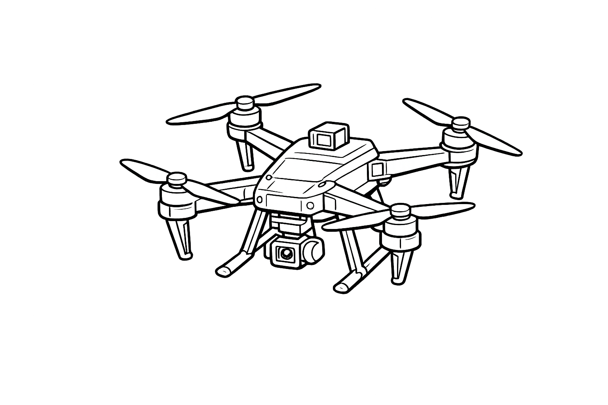

# ECE484 Quadrotor Project
<p align="center">
  
</p>

## Introduction

In this project, you will develop safe and robust control systems for autonomous drone flight. There are two phases: 

1. Simulation: Develop and test controllers in simulation. 
2. Deployment: Deploy and further optimize controllers on CrazyFlie hardware. 

You are required to achieve safe autonomous flight in both phases. Teams that deploy successfully will be allowed to participate in a competetition, in which lap times will be compared on various tracks. 

You may develop any controllers of your choosing. However, note that CrazyFlies are equipped only with an IMU. It has no other sensors, including cameras. 

## Setup

1. Clone repository. 
2. Install Pixi via `curl -fsSL https://pixi.sh/install.sh | sh`.

To install the simulation environment: 
1. In `~/ece484_fly`, run `pixi shell ` or `pixi shell -e gpu` if you have GPU. 
2. Run `python3 scripts/sim.py -r` to ensure successful installation. You should see a drone fly through four gates in the simulator.

To install the hardware deployment environment: 
1. In `~/ece484_fly`, run `pixi shell -e deploy`. 
2. Run the following to prepare the USB port for CrazyRadio to CrazyFlie communication: 
```
cat <<EOF | sudo tee /etc/udev/rules.d/99-bitcraze.rules > /dev/null
# Crazyradio (normal operation)
SUBSYSTEM=="usb", ATTRS{idVendor}=="1915", ATTRS{idProduct}=="7777", MODE="0664", GROUP="plugdev"
# Bootloader
SUBSYSTEM=="usb", ATTRS{idVendor}=="1915", ATTRS{idProduct}=="0101", MODE="0664", GROUP="plugdev"
# Crazyflie (over USB)
SUBSYSTEM=="usb", ATTRS{idVendor}=="0483", ATTRS{idProduct}=="5740", MODE="0664", GROUP="plugdev"
EOF

# USB preparation for crazyradio
sudo groupadd plugdev
sudo usermod -a -G plugdev $USER

# Apply changes
sudo udevadm control --reload-rules
sudo udevadm trigger
```
3. Open three terminals and run the below commands: 
```
# Terminal 1: Motion capture tracking node
ros2 launch motion_capture_tracking launch.py

# Terminal 2: Estimator node 
python3 -m drone_estimators.ros_nodes.ros2_node --drone_name cf10

# Terminal 3: Run the deployment script with the correct configuration and controller
python3 scripts/deploy.py --config level1.toml --controller <your_controller.py>
```

## Credit

We credit [Learning Systems Lab (LSY)](https://www.ce.cit.tum.de/lsy/home/) at TUM for their work on [lsy_drone_racing](github.com/utiasDSL/lsy_drone_racing) from [Learning Systems Lab (LSY)](https://www.ce.cit.tum.de/lsy/home/) at TUM.